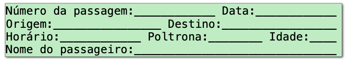

<style>
    /* Add "Page" prefix and total page number */
    section::after {
        font-size: small;
        content: 'Pág. ' attr(data-marpit-pagination) ' / ' attr(data-marpit-pagination-total);
    }


    section {
        padding-left: 1.1em;
        padding-right: 1.1em;
    }

    /** Seções */
    section:has(> header + h1 + footer) {
        background-color: #567890;        
    }

    section:has(> header + h1 + footer) * {
        color: white;
    }

    section:has(> header + h1 + footer) h1 {
        text-align: center;
        font-variant: small-caps;
        font-size: 6em;
    }
    /***/

    blockquote {
        border: 0;
        padding: 0;
        color: initial;
    }

    h1:has(~ blockquote) + blockquote {
        background-color: #7986CB;
        color: #fff;
        padding: .3em .5em;
        padding-left: 3.5em;
        border-radius: .25em;
        text-align: justify;
    }

    h1:has(~ blockquote) + blockquote:before {
        content: '⚠️';
        font-size: 2em;
        position: absolute;
        left: 1em;
        
    }

    img[center] {
        display: block;
        margin: 0 auto;
    }
    
    h1 code {
        font-size: .75em;
    }
</style>

# Estrutura  de Dados
### Dicionários, Tuplas e Conjuntos
#### Prof. Saulo Oliveira
Análise e Desenvolvimento de Sistemas


---
# Registros
---

# Registros

<style scoped>
    pre {
        width: 25%;
        position: absolute;
        left: 66%;
        top: 25%;
    }
    li, p {
        width: 63%;
    }
    
    
</style>

Algumas vezes precisamos armazenar, dentro de uma mesma variável, diferentes tipos de dados.

**Exemplo**: tipo de dado para gerenciar os alunos do IFCE. Cada aluno possui ```nome```, ```matricula```, ```nota1```, ```nota2```.

- É possível burlamos esses mecanismo com listas, mas nem sempre é legível trabalhar com índices númericos;
- Registros agregam vários dados acerca de uma mesma entidade.

```c
typedef struct {
    char* nome;
    char* matricula;
    float nota1;
    float nota2;
} student;

student saulo = {
    "Saulo Oliveira", 
    "20241....123",
    10.0,
    8.7
};
```

---

# Registros (2)

>  **Tipos de dados heterogêneos** são tipos de dados cujos elementos podem ser de tipos diferentes. Geralmente, é uma variável composta por campos. Cada campo possui um nome e pode ser de um tipo diferente.

Em miúdos, um registro é:
- **um tipo de dados composto**, pois adota a noção de conjunto de dados com o mesmo nome;
- **heterogêneo**, pois armazena dados com tipos (possivelmente) diferentes;
- **unidimensional**, pois seus dados são acessados por único campo (ou índice nominal).

---

# Registros (3)

A maior funcionalidade dos registros é poder gerar *"novos tipos de dados"*. Assim, o programador não fica limitado aos tipos de dados primitivos.



Para declarar uma variável do tipo registro, precisamos especificar: 
- Nome da variável;
- Os nomes e tipos dos seus campos.

---

# Dicionários  ```dict```

> Em Python, representamos registros através de dicionários (```dict```). Seus campos são normalmente chamados de chaves ou ```keys``` e o seus valores de ```values```.

Podemos criar dicionários de duas maneiras: 
1. Já com todos as chaves e valores;
```python
passagem = {'numero': 100, 'data': '01-10-2024', 'origem': 'Fortaleza'}
```
2. Ou inicializando um dicionário vazio e inserindo as chaves e valores depois.
```python
passagem = {}
passagem['numero'] = 100
passagem['data'] = '01-10-2024'
passagem['origem'] = 'Fortaleza'
```
---
# Acessando aos campos de um registro

> Podemos acessar cada campo de um registro, seja para gravar ou para recuperar um dado. O acesso a um determinado campo de registro é feito informando-se o nome da variável, seguido pelo nome do campo desejado dentro de colchetes.

```python
chaves_pix_saulo = {}
chaves_pix_saulo['tel'] = '(85) 99999-9991'
chaves_pix_saulo['email'] = 'saulo.oliveira@ifce.edu.br'
chaves_pix_saulo['cpf'] = '001.002.003-04'
chaves_pix_saulo['titular'] = 'Saulo Oliveira'

cpf = chaves_pix_saulo['cpf']
nome = chaves_pix_saulo['titular']

print(f'A chave CPF de {nome} é {cpf}.')
```

---

# Preenchendo uma lista de dicionários 

```python
funcionarios = [] # lista vazia

for i in range(4): # quatro funcionários 
    funcionario = {} # registro funcionário    
    
    # preenche os campos
    funcionario['nome'] = input('Digite o nome')
    funcionario['salario'] = float(input('...'))
    
    # atualiza a lista
    funcionarios.append(funcionario)

```

--- 

# Percorrendo uma lista de dicionários
<style scoped>
    pre {
        width: 65%;
    }

    pre + pre {
        position: absolute;
        width: 25%;
        left: 69%;
        top: 21%;
        font-size: 1em;
    }
</style>
```python
# laço estilo para cada
for funcionario in funcionarios:
    print(f'Nome: {funcionario['nome']}')
    print(f'Salário atual: {funcionario['salario']}')

# laço com enumerate
for indice, funcionario in enumerate(funcionarios):
    print(f'Funcionário #{indice + 1}')
    print(f'Nome: {funcionario['nome']}')
    print(f'Salário atual: {funcionario['salario']}')

# fora do laço de repetição
j = 2
print(f'Funcionário #{j + 1}')
print(f'Nome: {funcionarios[j]['nome']}')
print(f'Salário atual: {funcionarios[j]['salario']}')
```


```python
funcionarios = [
    # funcionarios[0]
    {
        'nome': 'Huguinho', 
        'salario': 1000
    },
    # funcionarios[1]
    {
        'nome': 'Zezinho',
        'salario': 300
    },
    # funcionarios[2]
    {
        'nome': 'Luisinho',
        'salario': 20
    }
]
```

---

# Operações com dicionários

<style scoped>
ul { 
    width: 40%;
}
blockquote {
    position: absolute;
    top: 24%;
    left: 45%;
    width: 45%;
}
pre {
    
    margin-left: 1em;
}
blockquote ul {
    width: 100%;
}
pre {
    width: 38%;
}
blockquote pre {
    width: 100%;
}
</style>

- Para navegar: 
```python
for chave in dicionario:
    print(chave)
    print(dicionario[chave])
```
- Para obter uma lista com as chaves:
```python
chaves = list(dicionario.keys())
```
- Para obter uma lista com os valores: 
```python
valores = list(dicionario.values())
```
> - Para percorrer um dicionário lendo uma chave e valor de cada vez:
> ```python
> for chave, valor in dicionario.items():
>     print(chave, valor)
> ```
> - Para verificar se uma chave existe, usamos os operadores ```in``` e ```not in```:
> ```python
> tem_chave = chave in dicionario
> nao_temchave = chave not in dicionario
> ```


--- 

# Exercícios

---

# Exercício 01 - Votação
Em uma eleição presidencial existem quatro candidatos. Os votos são informados através de códigos. Os dados utilizados para a contagem dos votos obedecem à seguinte codificação:  
- ```1```, ```2```, ```3```, ```4``` = voto para os respectivos candidatos;
- ```5``` = voto nulo;
- ```6``` = voto em branco.

Elabore um programa que leia o código do candidado em um voto. Como finalizador do conjunto de votos, tem-se o valor 0. Calcule e escreva:

a) Total de votos para cada candidato;
b) Total de votos nulos;
c) Total de votos em branco.

---

# Exercício 02  - Lista de compromissos

Vamos trabalhar com compromissos de uma pessoa. Um compromisso possui  um texto, uma data e um horário. Uma data deve possuir dia, mês e ano e um horário deve possuir hora e minuto, todos  números inteiros.

Crie uma lista de compromissos com 20 registros de compromissos com números aleatórios da seguinte forma: $1 \leq$ ```dia``` $\leq 20$, $1 \leq$ ```mês``` $\leq 12$, $2020 \leq$ ```ano``` $\leq 2024$, $0 \leq$ ```hora``` $\leq 23$ e $0 \leq$ ```minuto``` $\leq 59$. 

Por fim, o texto de todos os compromissos deve ser ```Compromisso de teste gerado aleatoriamente```.

```sh
========Lista de Compromissos========
Compromisso 1:
Data: xx/xx/xxxx
Horario: xx:xx:xx
Texto: Compromisso de teste gerado aleatoriamente.

Compromisso 2:
Data: xx/xx/xxxx
Horario: xx:xx:xx
Texto: Compromisso de teste gerado aleatoriamente.
```

```python
# gerador_int_aleatorio.py
from random import randint
n = randint(0, 20) # 0 <= n <= 20
```
<style scoped>
    pre {
        width: 40%;
        position: absolute;
        left: 51%;
        top: 44%;
        
    }

    pre + pre {
        top: 78%;
        font-size: .7em;
    }

    p code {
        font-size: .70em;
    }

    p + p {
        width: 50%;
    }

    li:nth-child(1) {
        width: 50%;
    }

    .MathJax {
        font-size: .8em;
    }
</style>
---

# Exercício 03 - Olha a entrega!

Considerando a tabela de rotas abaixo, crie um registro para cada cidade da Região de Planejamento do Sertão dos Inhamuns. Em cada registro, o campo é nome da cidade e o valor a distância (em Km) para uma outra cidade.

|                 | Aiuaba | Arneiroz | Quiterianópolis | Parambu | Tauá |
| -------------: | :----: | :------: | :-------------: | :-----: | :--: |
|     **Aiuaba**      |   0    |   35   |       144       |   140   | 78 |
|    **Arneiroz**     |  35  |    0     |       111       |   107   | 45 |
| **Quiterianópolis** |  144   |   111    |        0        |   50    | 69 |
|     **Parambu**     |  140   |   107    |       50        |    0    | 64 |
|      **Tauá**       |  78  |   45   |      69       |  64   |  0   |


<style scoped>
    table  {
        font-size: .7em;
        margin-left: 3em;
    }

    p {
        text-align: justify;
        width: 68%;
    }

    img {
        position: absolute;
        width: 11em;
        top: 25%;
        left: 70%;
    }
</style>

---

# Exercício 03 - Olha a entrega!

Com o código abaixo, gere uma rota aleatória e mostre a quilometragem total percorrida.

```python
from random import choices, randint

cidades = ['AIUABA', 'ARNEIROZ', 'QUITERIANOPOLIS', 'PARAMBU', 'TAUA']

numero_trechos = randint(2, 10) # numero de visitas
rota = choices(cidades, k=numero_trechos) # sorteio de cidades

total = 0 # faça a mágica aqui!

print('Percurso:')
print(' => '.join(rota))
print(f'Total de {total} Km rodados')
```


--- 

# Tuplas

---

# Tuplas

> Semelhante a uma lista, pois é uma sequência de valores, mas, diferentemente das listas, as **tuplas são imutáveis**.

Então podemos usar tuplas onde queremos inserir uma lista.

- Tuplas criadas com **notação de vírgula**, parênteses opcionais;
- Python sempre exibe tuplas com parênteses;
- Criar uma tupla de um elemento requer uma vírgula final. Não incluir esta vírgula, mesmo com parênteses, não produz uma tupla!

```python
t = 1, 2, 3, 4, 5       # tuple t = (1, 2, 3, 4, 5)
s = (1, 2, 3, 4, 5)     # tuple s = (1, 2, 3, 4, 5)
v = 'cat',              # tuple v = ('cat', )
y = ('cat')             # str   y = 'cat'
z = ('cat'),            # tuple z = ('cat', )
```

<style scoped>
    li:last-child {
        width: 38%;
    }
    ul + pre {
        position: absolute;
        left: 44%;
        top: 65%;
        width: 50%;
    }
</style>

---

# Comparação entre ```tuples``` 

> Tuplas suportam comparação, que funciona analogicamente à ordenação de ```str```. Assim, compara-se os valores índice por índice.

</br>

```python
(1, 2, 3) < (2, 2, 3)                                   # True

(2, 2, 20) <= (2, 2, 2)                                 # False

(1, 2, 3) < (1, 2, 3, 4)                                # True

('rato', 'gato', 'pato') < ('gato', 'rato', 'pato')     # False

(1, 'gato', (1, 2, 3)) > (0, 'baleia', (1, 2, 0))       # True
```

---

# Atribuição de tuplas

A atribuição de tupla requer uma variável à esquerda para cada expressão à direita:

```python
x, y, z = (2 * 'cat', 0.57721, [1, 2, 3])
print(x, y, z)                            # x = 'catcat', y = 0.57721, z = [1, 2, 3]
```

Se o número de variáveis não corresponde ao número de expressões, isso é um erro:

```python
(x, y, z) = ('a', 'b', 'c', 'd')
Traceback (most recent call last):
  File "<stdin>", line 1, in <module>
ValueError: too many values to unpack (expected 3)

(x, y, z) = ('a', 'b')
Traceback (most recent call last):
  File "<stdin>", line 1, in <module>
ValueError: not enough values to unpack (expected 3, got 2)
```

---

# Diferenças entre ```list``` e ```tuple```

**Use uma lista quando:**
- o comprimento não é conhecido com antecedência e/ou pode mudar durante a execução;
- atualizações frequentes são prováveis.
  
**Use uma tupla quando:**
- é improvável que o conjunto mude durante a execução;
- precisa-se inserir uma chave no conjunto (ou seja, requer imutabilidade);
- deseja-se executar várias atribuições ou usar em uma lista de argumentos de comprimento variável.
  
**A maioria dos códigos que você vê usará listas porque a mutabilidade é muito útil!**

---

# Desempacotamento de tuplas (1)

> O desempacotamento de tuplas é um recurso que nos permite atribuir valores a múltiplas variáveis em uma única declaração. Ele funciona desempacotando uma sequência (por exemplo, uma ```tuple```, ```list``` ou ```str```) em variáveis individuais. 

- O desempacotamento é um recurso poderoso em Python que pode tornar seu código mais conciso e legível;
- Podemos desempacotar tuplas em Python usando muitas maneiras, por exemplo, usando o ```*```, ```dict```, ```lambda``` e ```list comprehension```. 

**No próximo slide, veremos alguns exemplos.**

--- 

# Desempacotamento de tuplas (2)
<style scoped>
    pre {margin-top: -1em}
</style>
```python
# Desempacotamento de tupla em lista
tuples = ('Spark', 'Python', 'pandas', 'Java')
list1 = [*tuples,]
print(list1)

# Desempacotamento de tupla em um dicionário
tuples = ('Python', '50days', 25000)
my_dict = dict(zip(('courses', 'duration', 'fees'), tuples))
print(my_dict)

# Desempacotamento de tupla em um dicionário
tuples = ('Python', '50days', 25000)
dictionary = {}
dictionary['courses'], dictionary['duration'], dictionary['fees'] = tuples
print(dictionary)

# Desempacotamento de tupla em um list comprehension 
nested_tuple = ((2, 4), (6, 8), (10, 12))
result = [x + y for x, y in nested_tuple]
print(result)
```

---
# Exercícios
---
# Exercício com ```tuplas```

Abaixo, há uma lista de tuplas com dados da série BoJack Horseman da Netflix:

```python
personagens = [
    ("BoJack Horseman", "Will Arnett", "Cavalo"),
    ("Princess Carolyn", "Amy Sedaris", "Gato"),
    ("Diane Nguyen", "Alison Brie", "Humano"),
    ("Mr. Peanutbutter", "Paul F. Tompkins", "Cachorro"),
    ("Todd Chavez", "Aaron Paul", "Humano")
]
```

Escreva um programa que imprima cada tupla acima no seguinte formato:

```sh
BoJack Horseman é um Cavalo dublado por Will Arnet.
```

---

# Enumerate

--- 

# Enumerate
<style scoped>
    
    pre {
        width: 50%;
    }

    pre + pre {
        width: 20%;
        position: absolute;
        left: 60%;
        top: 38%;
    }

    pre:nth-child(5){
        top: 70%;
    }
</style>

Se  quisermos percorrer uma coleção e quisermos tanto o índice quanto o valor na coleção, podemos fazer isso via ```range``` e ```len``` , como visto antes:
```python
xyz = ['x', 'y', 'z']

for i in range(len(xyz)):
    value = xyz[i]
    print(f"{i}: {value}")
```
```python
# com enumerate
0: x
1: y
2: z
```


Ou você pode usar a função ```enumerate```, que obtém ambas as partes para você:

```python
xyz = ['x', 'y', 'z']

for i, value in enumerate(xyz):
    print(f"{i}: {value}")
```
```python
# com range
0: x
1: y
2: z
```
---

# Anatomia de uma enumeração

> A fução enumerate também pode receber um parâmetro chamado ```start=1``` que é o início da enumeração.
 
```python
nomes = ['Saulo', 'Oliveira']

for i, nome in enumerate(nomes):
    print(i, nome)

for i, nome in enumerate(nomes, start=1):
    print(i, nome)    
```

---
# Exercícios
---
# Exercícios com ```enumerate```

1. Chico tem ```1,50m``` e cresce ```2cm``` por ano, enquanto Zé tem ```1,10m``` e cresce ```3cm``` por ano. Construa um algoritmo que calcule e imprima em quantos ano Zé será maior que Chico.
2. Considerando o código abaixo que lista um conjunto de transações de Pix (de forma aleatória) em uma conta corrente. Mostre os dias em que se usou o cheque especial, isto é, ficou devendo. Você começa com R$ 0 reais de saldo!
```python
transacoes = [49, 40, -32, 11, 18, 9, -32, 1, -8, -34,
             -39, -30, -33, 38, 36, 35, -46, 16, 43, -23, 
             44, -22, 50, -50, 46, 24, 49, -42, 12, -1]
```
```python 
Saída:
10, 11, 12, 13, 14, 16, 17
```


---

# Zip

---

# Zip

> A função zip pega vários dados sequenciais (```list```, ```set```, ```dict```) e produz um item de cada lista como uma tupla cada vez que a próxima função é usada no resultado da função ```zip```.

```python
list1 = ['a', 'b', 'c', 'd', 'e', 'f', 'g']
list2 = [10, 20, 30, 40, 50]

for par in zip(list1, list2):
    print(par)

for letra, numero in zip(list1, list2):
    print(f'{letra} - {numero}')
```

```python
# par
('a', 10)
('b', 20)
('c', 30)
('d', 40)
('e', 50)
```


```python
# letra - numero
a - 10
b - 20
c - 30
d - 40
e - 50
```


A função ```zip``` pode receber quantas sequências você puder fornecer. No entanto, as tuplas só são organizadas com **base na sequências de menor tamanho**.

<style scoped>
    pre {
        width: 50%;

    }
    pre + pre {
        position: absolute;
        top: 48%;
        width: 10%;
        left: 55%;
    }

    pre + pre + pre {
        left: 70%;
        width: 20%;
    }

</style>


---

# Referências

- Python Software Foundation. **Built-in Functions.** Disponível em: https://docs.python.org/3/library/functions.html.
- CS106A Stanford. **Python Extras: Things you should know**. Disponível em: https://web.stanford.edu/class/archive/cs/cs106a/cs106a.1208/lectures/28-Python-Extras/28-Python-Extras.pdf.
- Keith Levin. **STATS 701 Data Analysis using Python.** Disponível em: https://pages.stat.wisc.edu/~kdlevin/teaching/Winter2018/STATS701/slides/lecture05.pdf.
