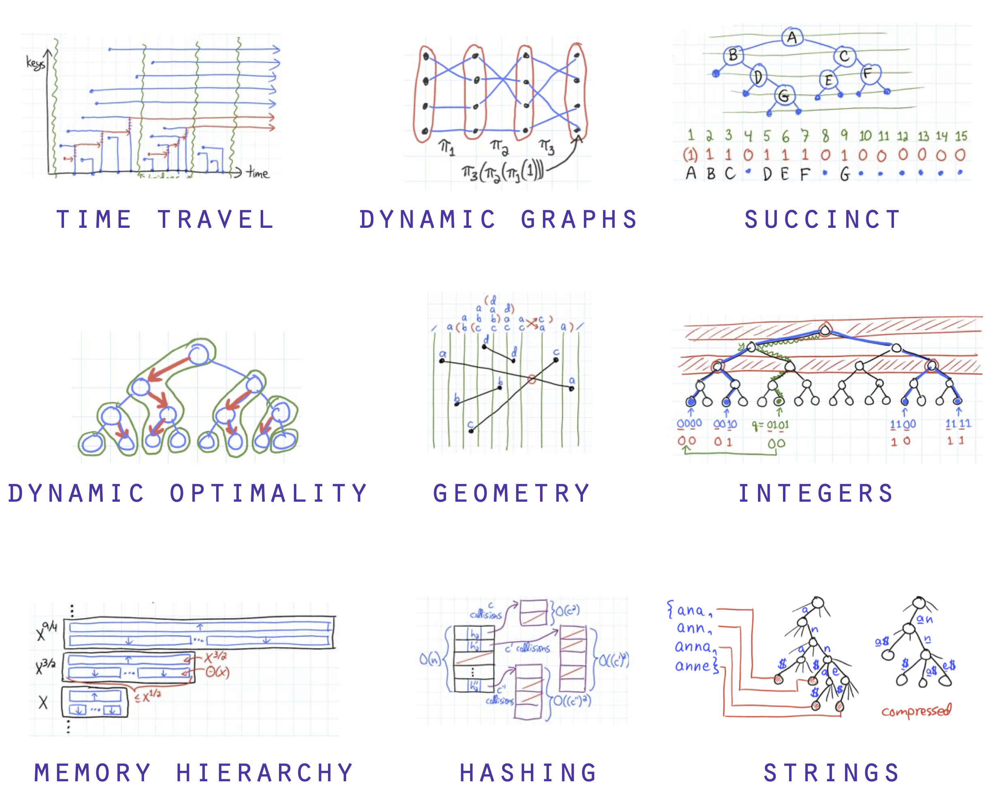

<style>
    /* Add "Page" prefix and total page number */
section::after {
    font-size: small;
  content: 'Pág. ' attr(data-marpit-pagination) ' / ' attr(data-marpit-pagination-total);
}

</style>
<style scoped>
    footer ~ * {color: red}
h1 {
  font-size: 3em;
  position: initial;
}

br::after {
    color: grey;
}

h5 {
    color: red;
}

[bg] {
    left: 
}
</style>


# Estrutura <br/> de Dados 

## 01. Introdução
#### Prof. Saulo Oliveira <br> Instituto Federal do Ceará
##### Análise e Desenvolvimento de Sistemas



---

# Agenda

<style scoped>
    ul {
        display: grid; /* Use CSS Grid */
        grid-template-columns: 1fr 1fr; /* Create two equal-width columns */
    }
</style>
- Tipo abstrato de dados
- Containers
- Listas e suas varianções
- Custo assintótico
- Pilhas
- Árvores e algumas variações
- Tabelas de espalhamento
- Métodos de busca
- Aplicações da indústria
- da
- das
- das
- das
- dasd
- as
- ds

--- 

# Tipo abstrato de dados

---

<style>
    blockquote {
        border: 0;
        padding: 0;
        color: initial;
    }
/* 
    blockquote:has(+blockquote) {
    }

    blockquote:has(+blockquote) {
        color:red;
        width: 48%;
        
    }
    blockquote:last-of-type {
        color: blue;
        width: 48%;
        position: absolute;
        left: 48%;
        top: 55.8%;
    }  */

    h1:has(~ blockquote) + blockquote {
        background-color: #7986CB;
        color: #fff;
        padding: .3em .5em;
        padding-left: 3.5em;
        border-radius: .25em;
    }
    h1:has(~ blockquote) + blockquote:before {
        content: '⚠️';
        font-size: 2em;
        position: absolute;
        left: 1.75em;
        
    }
    
</style>

# Typing

> **Python** não força anotações de tipos de variáveis e funções em tempo de execução. No entanto, ferramentas de terceiros como verificadores de tipo, IDEs, linters, etc, as usam.

Considere a função abaixo:

```python
def echo(text: str, n: int) -> str:
    return text * n
```

- A função ```echo``` recebe dois argumentos que se espera ser do tipo ```str``` e do tipo ```int```, respectivamente;
- Espera-se que a função retorne uma ```str```, conforme indicado pela *dica* ```-> str```.
- O módulo ```typing``` fornece *dicas de tipo* mais avançadas;


---

# TAD de um cubo :ice_cube: 
<style scoped>
    p, pre {width: 45%;}
    pre {margin-left: 1em ;position: absolute; left: 45%;}

</style>
Desenvolva um TAD que represente um cubo. 

Inclua as funções de inicialização necessárias e as operações que retornem o tamanhos de cada lado, a sua área e o seu volume.

```python
# cubo.py
class Cube:

    def __init__(self, side: float) -> None:
        raise NotImplemented

    @property
    def side(self) -> float:
        raise NotImplemented

    def area(self) -> float:
        raise NotImplemented
    
    def volume(self) -> float:
        raise NotImplemented
```

--- 

# Referências

- Python Software Foundation. **typing — Support for type hints**. 2024. Disponível em: https://docs.python.org/3/library/typing.html
