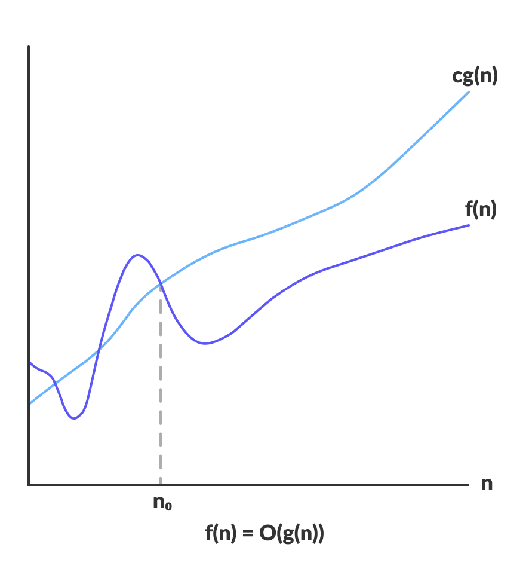
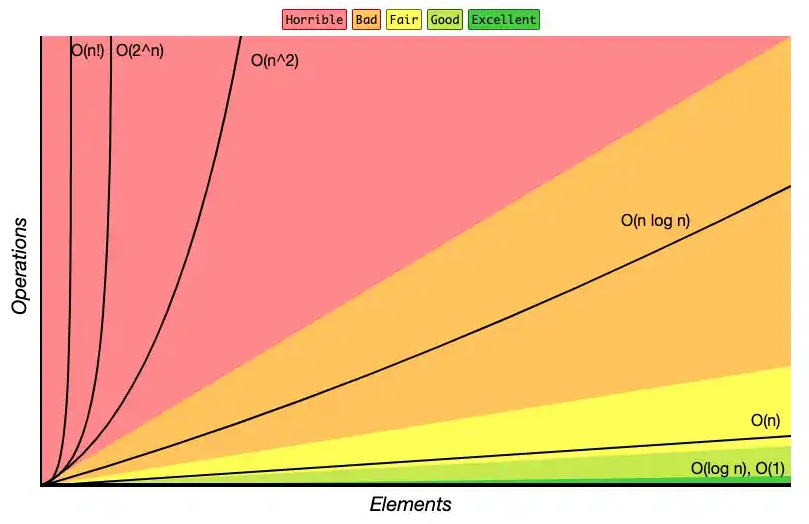

<style>

    footer {
        color: #567890;
    }
    /* Add "Page" prefix and total page number */
    section::after {
        font-size: small;
        content: 'Pág. ' attr(data-marpit-pagination) ' / ' attr(data-marpit-pagination-total);
    }


    section {
        padding-left: 1.1em;
        padding-right: 1.1em;
    }

    /** Seções */
    section:has(> header + h1 + footer) {
        background-color: #567890;        
    }

    section:has(> header + h1 + footer) * {
        color: white;
    }

    section:has(> header + h1 + footer) h1 {
        text-align: center;
        font-variant: small-caps;
        font-size: 6em;
    }
    /***/

    blockquote {
        border: 0;
        color: initial;        
        background-color: #7986CB22;
        padding: .3em .5em;
        border-radius: .25em;
        text-align: justify;
    }

    blockquote:has(> h1) {
        padding: 0em;
        padding-bottom: .5em;
        border-bottom-left-radius: .5em;
        border-bottom-right-radius: .5em;
    }
    blockquote:has(> h1) :not(h1, strong, .MathJax) {
        margin-right: .5em;
    }
    blockquote:has(> h1) p {
        margin-left: .5em;
    }


    blockquote h1 {
        color: white;
        font-variant: small-caps;
        font-size: 1em;
        background-color: #7986CB;
        margin: 0;
        padding: .3em .5em;
        border-top-left-radius: .5em;
        border-top-right-radius: .5em;
        margin-bottom: .5em;
    }

    blockquote:has(> blockquote:has(> blockquote)) {
        background-color: #7FFFD4;        
    }
    blockquote:has(> blockquote) {
        background-color: #F4A46044;        
    }


    blockquote:has(> blockquote) blockquote {
        background-color: transparent;
        padding: 0;
    }

    /* h1:has(~ blockquote) + blockquote {
        background-color: #7986CB;
        color: #fff;
        padding: .3em .5em;
        padding-left: 3.5em;
        border-radius: .25em;
        text-align: justify;
    }

    h1:has(~ blockquote) + blockquote:before {
        content: '⚠️';
        font-size: 2em;
        position: absolute;
        left: 1em;
        
    } */

    img[center] {
        display: block;
        margin: 0 auto;
    }
    
    h1 code {
        font-size: .75em;
    }

    h4 {
        font-size: .75em;
        font-weight: 400;
        line-height: 1.7;
        font-variant: small-caps;
    }

    h2, h3, h4 {
        margin: 0;
    }
</style>

# Estrutura  de Dados
## Introdução ao Comportamento Assintótico
#### Curso de Análise e Desenvolvimento de Sistemas
#### Última revisão: **2024.2**


---
# Análise de algoritmos
---
# Análise de algoritmos
Analisar um algoritmo consiste em **verificar** seu **custo** em relação a dois fatores*:
 - **Tempo** gasto para executá-lo; e
 - **Espaço** (memória) ocupado em sua execução.

> # Custo de um algoritmo
> - O **menor custo** possível  de uma classe de algoritmos nos dá a **dificuldade inerente para resolver o problema**;
> - Quando o custo de um algoritmo é igual ao menor custo possível, o algoritmo é **ótimo** para aquela medida de custo considerada;
> - Podem existir vários algoritmos **ótimos** para o mesmo problema;
> - Se dispusermos de uma ferramenta comparativa, podemos  **escolher o mais adequado**.
<!-- 
<small>
Há outras formas de verificar o custo, o consumo de energia por exemplo, para celulares, pegada de carbono para EAGs.
</small> -->

---
# Exemplo: Maior elemento de uma lista (1)

Considere o algoritmo para encontrar o maior elemento de uma lista com no mínimo um elemento.

```python
def max(valores: list[float]) -> float:
    maior = valores[0]
    
    for valor in valores:
        if maior < valor: # comparação 
            maior = valor
    
    return maior
```

- Seja $f$ uma função de complexidade tal que **$f (n)$ é o número de comparações envolvendo os elementos de** ```valores```, se ```valores``` contiver $n$ elementos, isto é, ```n = len(valores)```.
- Qual função é $f(n)$?

---

# Exemplo: Maior elemento de uma lista (2)

> **Teorema**: Qualquer algoritmo para encontrar o maior elemento de um conjunto com $n$ elementos, $n \geq 1$, faz pelo menos $n − 1$ comparações.


> **Prova**: Cada um dos $n − 1$ elementos tem de ser investigado por meio de comparações, que é menor do que algum outro elemento. **Logo, $n-1$ comparações são necessárias.**

> # Resultado
> O teorema acima nos diz que, se o número de comparações for utilizado como medida de custo, então a função Max do programa anterior é ótima.

---

# Definições

> # Melhor caso
> É o **menor tempo de execução** sobre todas as entradas de tamanho $n.$

> # Pior caso
> É o **maior tempo de execução** sobre todas as entradas de tamanho $n.$


> # Caso médio (ou caso esperado) – o mais difícil de calcular
> É a **média dos tempos de execução** de todas as entradas de tamanho $n.$

<br />

$$ \text{Melhor caso} \leq \text{Caso médio} \leq \text{Pior caso}$$ 


---

# Exemplo: ficha de treino  🏋️‍♀️🏋️

> # Problema
> Considere o problema de encontrar sua ficha de treino na academia que o IFCE vai inaugurar. Cada ficha contém um indentificador único que é utilizada para recuperá-lo (a matrícula).
> 
> 
> **Situação**:
> Dado que as fichas são armazenadas numa caixa qualquer sem organização, localizar qualquer a ficha com base matrícula;
> 
>
> **Solução:**
> O algoritmo de pesquisa mais simples é o que faz a **pesquisa sequencial**.

  

---

# Exemplo: ficha de treino  (análise)

Seja $f (n)$ uma função de complexidade, em que $n$ corresponde ao número de fichas. A complexidade será definida pelo número de fichas consultadas (número de comparações de matrícula):

> **Melhor caso**:
> É quando a ficha procurada é a **primeira consultada**, isto é, $f(n) = 1$.

> **Pior caso**:
> É quando a ficha procurada é a **última consultada**, isto é, $f(n) = n$.

> **Caso médio**:
É quando a ficha procurada é a ..., e isso significa o quê? $f(n) = ~ \text{?}$

---

# Exemplo: ficha de treino (análise do caso médio)

No estudo do caso médio, consideremos que toda pesquisa recupera uma ficha.

- Se $p_i$ for a probabilidade de que a $i$-ésima ficha seja procurada, e considerando que para recuperá-la são necessárias $i$ comparações, então:
$$f(n) = 1 \times p_1 + 2 \times p_2 + 3 \times p_3 + \ldots + n \times p_n$$
- Para calcular $f (n)$ basta conhecer a distribuição de probabilidades $p_i$;
-  Para facilitar, vamos supor que cada ficha tem a mesma probabilidade de ser recuperada que todas as outras, então:
  $$p_i = \frac{1}{n},  1 \leq i \leq n$$ 
- Logo, $f(n) = \dfrac{1}{n}(1 + 2 + 3 + \ldots + n) = \dfrac{1}{n} \left( \dfrac{n \times (n + 1)}{2} \right) = \dfrac{n + 1}{2}$.

---
# Exercícios
---
<style scoped>
    pre {
        width: 40%;
    }
    pre + pre {
        position: absolute;
        left: 50%;
        top: 49.5%;
    }
</style>
# Exercícios
**Avalie os dois códigos abaixo e responda**:

a) O resultado será o mesmo? Justifique sua resposta.
b) Qual a função de complexidade de cada um? Defina as operações relevantes.
c) Caso o resultado seja o mesmo, qual dos dois você escolheria?

```python
def fn1(n: int) -> int:
    i = a = 0
    while i < n:
        a += i
        i += 2
    return a
```

```python
def fn2(n: int) -> int:
    a = 0
    for i in range(n):
        for j in range(i):
            a += i + j
    return a
```

**Dica**: Avalie o código e faça testes na mão, só depois de responder às perguntas, implemente o código e execute-os para conferir os resultados.

---
# MinMax
---
# MinMax (1)
<style scoped>
    pre, ul {width: 50%}
    ul {
        position: absolute;
        left: 52%;
        top: 40%;
        width: 40%;
    }
</style>
Considere o problema de encontrar o maior e o menor valor de uma lista de inteiros ```A``` de tamanho $n$ , isto é, ```n = len(A)```.

```python
def minmax(A: list[int]) -> tuple[int, int]:
    minimo = maximo = A[0]
    
    for a in A:
        if a < minimo:
            minimo = a

        if a > maximo:
            maximo = a

    return minimo, maximo
```

- Seja $f (n)$ o número de comparações entre os elementos de ```A```, se ```A``` contiver $n$ elementos.
- Então, $f (n) = 2(n - 1)$ para $n > 0$, para o melhor caso, pior caso e caso médio!

---
# MinMax (2)
<style scoped>
    pre {width: 48%}
    ul {
        position: absolute;
        left: 50%;
        top: 38%;
        width: 40%;
    }

</style>
O algoritmo de ```minmax``` pode ser levemente melhorado, pois a comparação ```a > maximo``` só é necessária quando a comparação ```a < minimo``` é ```False```. 
**E agora, qual é a função de complexidade?**

```python
def minmax(A: list) -> tuple[int, int]:
    
    minimo = maximo = A[0]
    
    for a in A:
        if a < minimo:
            minimo = a

        elif a > maximo: # aqui!
            maximo = a

    return minimo, maximo
```

- **Melhor caso** é quando a lista está ordenada crescentemente. Logo, $f(n) = n - 1$;
- **Pior caso** é quando o valor máximo é o primeiro. Logo, $f(n) = 2(n - 1)$;
- **Caso médio** é quando se testa ```a < minimo``` em metade das vezes. Logo, $f(n) = \dfrac{3n}{2} - \dfrac{3}{2}$.

---

# MinMax (3)

- Considerando o número de comparações realizadas, existe a possibilidade de obter um algoritmo mais eficiente.
 - Os elementos da lista são comparados dois a dois.
    - Somente o valor menor do par é comparado com a variável ```minimo```;
    - Somente o valor maior do par é comparado com a variável ```maximo```;
  - Para evitar um tratamento de exceção, deixamos a lista com tamanho com par. Para isso, repetimos o último elemento quando o tamanho da lista é ímpar;
  - Para implementação, tem-se que o **Melhor caso = Caso médio = Pior caso**.

$$ f(n) = \frac{n}{2} + \frac{n-2}{2} + \frac{n-2}{2} = \frac{3n}{2} -2 $$

--- 


# MinMax (3)

```python
def minmax(A: list[int]) -> int:
    if len(A) % 2 != 0: # truque pra deixar a lista com tamanho par
        A.append(A[-1])
    
    if A[0] < A[1]:
        minimo, maximo = A[0], A[1]
    else:
        minimo, maximo = A[1], A[0]
    
    for a, b in zip(A[2::2], A[3::2]):
        if a > b:
            if a > maximo: maximo = a
            if b < minimo: minimo = b
        else:
            if a < minimo: minimo = a
            if b > maximo: maximo = b
    return maximo, minimo
```

---
# Comportamento assintótico de funções
**Recapitulando** ...
- Aprendemos a calcular a função de complexidade $f (n).$
- Para valores pequenos de $n$, praticamente qualquer algoritmo custa pouco para ser executado. Logo, a escolha do algoritmo tem pouquíssima influência em problemas de tamanho pequeno;
- Assim, a análise de algoritmos deve ser realizada para valores grandes de $n$. Para isso, estuda-se o comportamento assintótico das funções de custo.

> # Comportamento assintótico
> O comportamento assintótico de uma função $f (n)$representa o limite do comportamento do custo quando $n$cresce, ou seja, qunado $n \to \infty.$


---

# Exemplo

Considere o número de operações de cada um dos dois algoritmos que resolvem o mesmo problema:

a) **Alg. 1** tem custo $f_1(n) = 2n^2+5n$ operações;
b) **Alg. 2**  tem custo $f_2(n) = 50n + 4000$ operações.

Dependendo do valor de $n$, o **Alg. 1** pode requerer mais ou menos operações que o **Alg. 2**:

| $n=10$                            | $n=100$                               |
| :-------------------------------- | :------------------------------------- |
| $f_1(10) = 2*(10)^2 + 5*10 = 250$ | $f_1(100) = 2*(100)^2 + 5*100 =20.500$ |
| $f_2(10) = 50*10 + 4000 = 4.500$  | $f_2(100) = 50*100 + 4000 = 9.000$      |

---
# Notação $O(n)$
---

# Comportamento assintótico

> # Comportamento assintótico
> - Quando $n$tem valor muito grande $(n \to \infty)$;
> - Termos inferiores e constantes multiplicativas contribuem pouco na comparação e podem ser descartados

Tomando o exemplo anterior:
- Alg. 1 definido por $f_1(n) = 2n^2 + 5n$ operações;
- Alg. 2 definido por $f_2(n) = 50n + 4000$ operações;
- $f_1$ cresce com $n^2$;
- $f_2$ cresce com $n$;
- Como o crescimento quadrático é pior que o linear, o **Alg. 2 é melhor do que o Alg. 1**. 

---

# A notação O (*Big O* ou ômicron)

A notação $O$ nos dá um limite **superior assintótico** – o **Pior Caso**.

> # Definição
> - Sejam $f$e  $~g$duas funções de domínio $X.$
> - Dizemos que a função $f = O(g(n))$se e somente se:
> $$ (\exists ~c \in \mathbb{R}_{+})(\exists ~n_0 \in X)(\forall ~ n \geq n_0)(0 \leq f(n) \leq c \cdot g(n)).$$

**Exemplos**:
- $3n + 2 = O(n)$, pois  $3n + 2 \leq 4n$ para todo $n \geq 2$
- $1000n^2 + 100n - 6 = O(n^2)$, pois $1000n^2 +100n - 6 \leq 1001n^2$ para $n \geq 100$
- $f(n) = a_mn^m+\ldots+a_1n + a_0 \Rightarrow f(n) = O(n^m)$

---

# A notação O (*Big O* ou ômicron)


<style scoped>
    blockquote {
        position: absolute;
        top: 7em;
        left: 40%;
        list-style-type: none;
    }
</style>

Exemplo gráfico de dominação assintótica que ilustra a notação $O$.



> # Algumas propriedades para o cômputo de $O(n)$
> - $f (n) = O(f (n))$
> - $c ∗ O(f (n)) = O(f (n)), ~c=$constante
> - $O(f (n)) + O(f (n)) = O(f (n))$
> - $O(O(f (n))) = O(f (n))$
> - $O(f (n)) + O(g(n)) = O(\max(f (n), g(n)))$
> - $O(f (n)) ∗ O(g(n)) = O(f (n) ∗ g(n))$
> - $f (n) ∗ O(g(n)) = O(f (n) ∗ g(n))$

---

# Colinha
<style scoped>
    img {
        display: block;
        width: 60%;
        margin: 0 auto;
    }
</style>

$$O(1) < O(\log n) < O(n ) < O(n \log n) < O(n^2) < O(n^3) < O(c^n) < O(n!)$$

---
# Exercícios
---

# Exercícios (1)

<style scoped>
    ol li {
        margin-top: 1.3em;
    }
</style>
1. Para os itens que segue, indique se $g(n)$ domina $f(n)$ assintoticamente. Justifique.

- $f(n) = (n+1)^2$ e $g(n)=n^2$
- $f(n) = n$ e $g(n) = n^2$
- $f(n) = 3n^3+ 2n^2 + n$ e $g(n)=O(n^{40})$
  
2. Qual a ordem de complexidade do MaxMin (1) ?
3. Suponha um algoritmo com três trechos cujos tempos de execução são $O(n)$, $O(n^2)$ e $O(n \log n)$, respectivamente. Qual a ordem de complexidade deste algoritmo?

---

# Exercícios (2)

<style scoped>
    pre {width: 45%; margin-top: 1em;}
    pre + pre {
        position: absolute;
        top: 10.7em;
        left: 50%;

    }
</style>
4. No próximo slide há dois algoritmos. Obtenha a função de complexidade $f (n)$ dos algoritmos abaixo. Considere apenas as operações envolvendo as variáveis ```x``` e ```y```.

```python
def funcao1(n: int) -> None:

    x = y = 0
    
    for i in range(1, n + 1):
        
        for j in range(i, n + 1):
            x += 1
        
        for j in range(i):
            y += 1
```


```python
def funcao2(n: int) -> None:
    x = 0
    
    for i in range(1, n + 1):
        
        for j in range(1, n + 1):
            
            for j in range(1, j):
                x += j + k
    
    x = n
```


---

# Referências

- Paul Rail. **All you need to know about “Big O Notation” to crack your next coding interview.** Disponível em: https://www.freecodecamp.org/news/all-you-need-to-know-about-big-o-notation-to-crack-your-next-coding-interview-9d575e7eec4/.
- Prof. José Maria Monteiro. **INF 1010 Estruturas de Dados Avançadas: Complexidade de Algoritmos**. Disponível em: https://www.inf.puc-rio.br/~noemi/eda-19.1/complexidade.pdf.
- Prof. Reinaldo Fortes. **BCC202 - Estrutura de Dados I Aula 04: Análise de Algoritmos (Parte 1).** Disponível em: https://www.decom.ufop.br/reifortes.
- Prof. Reinaldo Fortes. **BCC202 - Estrutura de Dados I Aula 05: Análise de Algoritmos (Parte 2).** Disponível em: https://www.decom.ufop.br/reifortes.
- Programiz. **Asymptotic Analysis: Big-O Notation and More.** Disponível em: https://www.programiz.com/dsa/asymptotic-notations.
