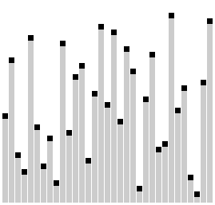

<style>

    footer {
        color: #567890;
    }
    /* Add "Page" prefix and total page number */
    section::after {
        font-size: small;
        content: 'Pág. ' attr(data-marpit-pagination) ' / ' attr(data-marpit-pagination-total);
    }


    section {
        padding-left: 1.1em;
        padding-right: 1.1em;
    }

    /** Seções */
    section:has(> header + h1 + footer) {
        background-color: #567890;        
    }

    section:has(> header + h1 + footer) * {
        color: white;
    }

    section:has(> header + h1 + footer) h1 {
        text-align: center;
        font-variant: small-caps;
        font-size: 6em;
    }
    /***/

    blockquote {
        border: 0;
        color: initial;        
        background-color: #7986CB22;
        padding: .3em .5em;
        border-radius: .25em;
        text-align: justify;
    }

    blockquote:has(> h1) {
        padding: 0em;
        padding-bottom: .5em;
        border-bottom-left-radius: .5em;
        border-bottom-right-radius: .5em;
    }
    blockquote:has(> h1) :not(h1, strong, .MathJax) {
        margin-right: .5em;
    }
    blockquote:has(> h1) p {
        margin-left: .5em;
    }


    blockquote h1 {
        color: white;
        font-variant: small-caps;
        font-size: 1em;
        background-color: #7986CB;
        margin: 0;
        padding: .3em .5em;
        border-top-left-radius: .5em;
        border-top-right-radius: .5em;
        margin-bottom: .5em;
    }

    blockquote:has(> blockquote:has(> blockquote)) {
        background-color: #7FFFD4;        
    }
    blockquote:has(> blockquote) {
        background-color: #F4A46044;        
    }


    blockquote:has(> blockquote) blockquote {
        background-color: transparent;
        padding: 0;
    }

    /* h1:has(~ blockquote) + blockquote {
        background-color: #7986CB;
        color: #fff;
        padding: .3em .5em;
        padding-left: 3.5em;
        border-radius: .25em;
        text-align: justify;
    }

    h1:has(~ blockquote) + blockquote:before {
        content: '⚠️';
        font-size: 2em;
        position: absolute;
        left: 1em;
        
    } */

    img[center] {
        display: block;
        margin: 0 auto;
    }
    
    h1 code {
        font-size: .75em;
    }

    h4 {
        font-size: .75em;
        font-weight: 400;
        line-height: 1.7;
        font-variant: small-caps;
    }

    h2, h3, h4 {
        margin: 0;
    }
</style>

# Estrutura  de Dados
## Ordenação e Busca
#### Curso de Análise e Desenvolvimento de Sistemas
#### Última revisão: **2024.2**


---
# Ordenação e Busca
---

# Isenção de responsabilidade
<style scoped>
    blockquote {
        margin: 3em auto;
    }
</style>

> # Isenção de responsabilidade
> Os códigos apresentados em Python têm como objetivo principal proporcionar aprendizado e entendimento sobre os conceitos abordados. Embora sejam funcionais e didáticos, não representam necessariamente as soluções mais otimizadas ou recomendadas para aplicações em produção. Sempre considere ajustar e aprimorar os exemplos conforme as necessidades específicas do seu projeto e as boas práticas de programação.


```python
class Comparable:

    @abstractmethod
    def compare_to(self, other) -> int:
        pass

    def __eq__(self, other):
        return self.compare_to(other) == 0

    def __leq

```

É verdade esse bilhete!

---

# Bubble sort
---
# Bubble sort
<style scoped>
    pre {width: 60%; margin-left: 1em;}
    img {
        position: absolute;
        top: 32.3%;
        left: 65%;
        width: 13.8em;
    }
</style>
Talvez a estratégia mais simples para se ordenar seja comparar pares de itens consecutivos e permutá-los, caso estejam fora de ordem. Assim funciona o Bubble Sort.

```python
def bubble_sort(data: list[Comparable]):

    n = len(data)

    for i in range(n):

        for j in range(n):

            if data[j] > data[i]:
                
                data[i], data[j] = data[j], data[j]

```


Ordene, a seguir, na mão, usando o BubbleSort: ```[92, 80, 71, 63, 55, 41, 39, 27, 14]```.


---
# Selection sort
---
# Selection sort
<style scoped>
    pre {width: 60%; margin-left: 1em;}
    img {
        position: absolute;
        top: 37.8%;
        left: 68%;
        width: 11em;
    }
</style>
A estratégia básica desse método é, em cada fase, selecionar um menor item ainda não ordenado e permutá-lo com aquele que ocupa a sua posição na sequência ordenada. 

```python
def argmin(data: list) -> int:
    m = min(data)
    return data.index(m)

def selection_sort(data: list[Comparable]):
    
    for i in range(len(data)):
        
        k = argmin(data[i:])
        
        data[i], data[k] = data[k], data[i]
```

Ordene, a seguir, na mãe, usando o SelectionSort: ```[46, 55, 59, 14, 38, 27]```.


---

# Insertion sort
---
# Insertion sort
<style scoped>
    p:nth-of-type(1) {margin-top: -1em}
    pre {width: 60%; margin-left: 1em;}
    img {
        position: absolute;
        top: 37.5%;
        left: 67%;
        width: 12em;
    }
</style>

Ao ordenar uma sequência $L = [L_{O}, L_{D}]$, considera-se uma subsequência ordenada $L_{O}$ e outra desordenada $L_{D}$. Então, em cada fase, remove-se um item de $L_{D}$ e o insere na sua posição correta dentro de $L_{O}$.

```python
def insertion_sort(data: list[Comparable]):
   
    for i in range(1, len(data)):
        x = data[i]
        j = i - 1

        while j >= 0 and data[j] > x:
            data[ j + 1 ] = data[j]
            j = j - 1

        data[j + 1] = x
    return data
```
Exercite a ordenação acima na sequência: ```[82, 50, 71, 63, 85, 43, 39, 97, 14]```. 


---
# Merge sort
---
# Merge sort
<style scoped>
    p {width: 70%; }
    p:nth-of-type(1) {
        margin-top: -.75em;
    }
    img {
        width: 20%;
        position: absolute;
        top: 20%;
        left: 73%;
    }
</style>
O funcionamento do Merge Sort baseia-se em uma rotina fundamental cujo nome é ```merge```. Primeiro vamos entender como ele funciona e depois vamos ver como sucessivas execuções de ```merge``` ordena uma sequência.

A rotina de ```merge``` é a que combina duas sequências ordenados em um outro também ordenado:
-  Uma das duas partes da sequência será consumida em sua totalidade antes da outra;
-  Basta então fazer o ```append``` de todos os elementos faltantes;
- Merge Sort é um algoritmo de divisão-e-conquista;
- Na **divisão**, dividimos recursivamente na metade até que sobre apenas um elemento. Na **conquista**, combinamos duas sequências ordenados em uma também ordenada.




---
# Merge sort
<style scoped>
    pre {
        width: 65%; 
        margin-top: -1em; 
        box-shadow: 0px 0px 2px lightgray;
    }
    code {
        padding-bottom: -1em;
    }
    pre + pre {
        
        position: absolute;
        width: 42%;
        left: 50%;
        top: 35%;
    }
</style>
```python
def merge(a: list[int], b: list[int]):

    c = []
    
    while len(a) > 0 and len(b) > 0:
    
        if a[0] > b[0]:
            c.append( b[0] )
            b.pop(0)
        else:
            c.append( a[0] )
            a.pop(0)
    
    c.extend(a)
    c.extend(b)

    return c
```

```python
def merge_sort(data: list[int]):

    if len(data) < 2:
        return data

    # divisão
    meio = len(data) // 2

    esquerda = merge_sort(data[:meio])
    direita  = merge_sort(data[meio:])
    
    # conquista
    return merge(esquerda, direita)
```


---
# Quick sort
---
# Quick sort
<style scoped>
    pre {
        width: 68%;
    }

    h1 + p {
        margin-top: -.75em;
        width: 70%;
        text-align: justify;
    }

    pre + pre {
        position: absolute;
        width: 50%;
        left: 42%;
        top: 56%;
        box-shadow: 1px 1px 1px lightgray;
    }

    img {
        position: absolute;
        top: 16%;
        left: 72%;
    }
</style>
O Quick Sort baseia-se em uma rotina fundamental cujo nome é ```particionamento```. Particionar significa escolher um valor qualquer presente, chamado de **pivot**, e colocá-lo em uma posição tal que todos os elementos à esquerda são menores ou iguais e todos os elementos à direita são maiores.


```python
def quick_sort(data: list[Comparable]):
    
    if len(data) <= 1:
        return data

    pivot = data[0]

    m, M = partition(data[1:])

    return quicksort(m) + [pivot] + quicksort(M)
```

```python
def partition(data: list, pivot: Any) -> tuple:

    m = [x for x in data if x <= pivot]
    M = [x for x in data if x > pivot]

    return m, M
```


---

# Análise de complexidade
<style scoped>
    table {
        margin: 0em auto;
        margin-top: 2em;
        margin-bottom: 3em;
    }
</style>
Segue uma tabela de comparação com as notações dos algoritmos de ordenação.


| Algoritmo/Tempo | Melhor          | Médio           | Pior            |
| --------------- | --------------- | --------------- | --------------- |
| Merge sort      | $O(n \log n)$ | $O(n \log n)$ | $O(n \log n)$ |
| Quick sort      | $O(n \log n)$   | $O(n \log n)$   | $O(n^2)$        |
| Bubble sort     | $O(n)$          | $O(n^2)$        | $O(n^2)$        |
| Insert sort     | $O(n)$          | $O(n^2)$        | $O(n^2)$        |
| Selection sort  | $O(n^2)$        | $O(n^2)$        | $O(n^2)$        |

---
# Busca
---
# Busca linear
<style scoped>
    pre {width: 60%;}
    pre + p {
        position: absolute;
        top: 38%;
        width: 30%;
        left: 65%;
    }
    p + p {
        width: 65%;
    }
</style>

A busca é o processo em que se determina se um particular elemento $x$ é membro de uma determinada sequência $\mathcal{S}$. Dizemos que a busca tem sucesso se $x \in \mathcal{S}$ e que fracassa em cc.


```python
def linear_search(data: list, x: Any) -> bool:

    for y in data:

        if x == y:
            return True

    return False
```
A vantagem da busca linear é que ela sempre funciona, independentemente da seuquência estar ou não ordenada. A desvantagem é que ela para encontrar um determinado item ```x```, precisa examinar todos os itens que precedem ```x```.

No pior caso, quando o item procurado não consta na sequência, a busca linear precisa verificar todos os elementos.

---

# Busca binária
<style scoped>
    p:nth-of-type(1) {
        margin-top: -0.5em;
    }
</style>
Se não sabemos nada a respeito da ordem em que os itens aparecem, o melhor que podemos fazer é uma busca linear. Entretanto, se os itens aparecem ordenados, podemos usar um método de busca muito mais eficiente. 

> # Analogia com um Dicionário do mundo real
> Esse método é semelhante àquele que usamos quando procuramos uma palavra num dicionário: primeiro abrimos o dicionário numa página aproximadamente no meio; se tivermos sorte de encontrar a palavra nessa página, ótimo; senão, verificamos se a palavra procurada ocorre antes ou depois da página em que abrimos e então continuamos, mais ou menos do mesmo jeito, procurando a palavra na primeira ou na segunda metade do dicionário...

Como a cada comparação realizada o espaço de busca reduz-se aproximadamente à metade, esse método é denominado busca binária. 

---

# Busca binária
<style scoped>
    pre {
        width: 60%;
    }
    ul {
        width: 30%;
        position: absolute;
        top: 20%;
        left: 61%;
        list-style-type: none;
    }
    li:nth-of-type(1) {
        margin-bottom: 1em;
    }
    .MathJax:nth-of-type(1) {
        font-size: .9em;
    }
</style>
```python
def binary_search(data: list[Sorted], x: Any) -> bool:    
    
    # Caso base: intervalo vazio
    if len(data) == 0:
        return False

    pos_meio = len(data) // 2
    meio = data[pos_meio]

    if meio == x:
        return True

    if x < meio:
        return binary_search(data[:meio], x)

    return binary_search(data[meio:], x)
```

- O número de comparações feitas pelo algoritmo de busca binária tende a ser muito menor que aquele feito pela busca linear.
- 
- **Exemplo**. Para encontrar um item num dentro 5000 itens, o número de comparações chega se reduzir a 13.  
  
  
Tamanho reduz na ordem de $\log_2 n$: 

$$5000 \Rightarrow 2500 \Rightarrow 1250 \Rightarrow 625 \Rightarrow 312 \Rightarrow 156 \Rightarrow 78 \Rightarrow 39 \Rightarrow 19 \Rightarrow 9 \Rightarrow 4 \Rightarrow 2 \Rightarrow 1 \Rightarrow 0$$


---

# Referências

- João Arthur Brunet. **Ordenação por Comparação: Merge Sort.** Disponível em: https://joaoarthurbm.github.io/eda/posts/merge-sort/.
- Silvio Lago. **Ordenação e Busca**. Disponível em: https://www.ime.usp.br/~slago/slago-ordena-busca.pdf.