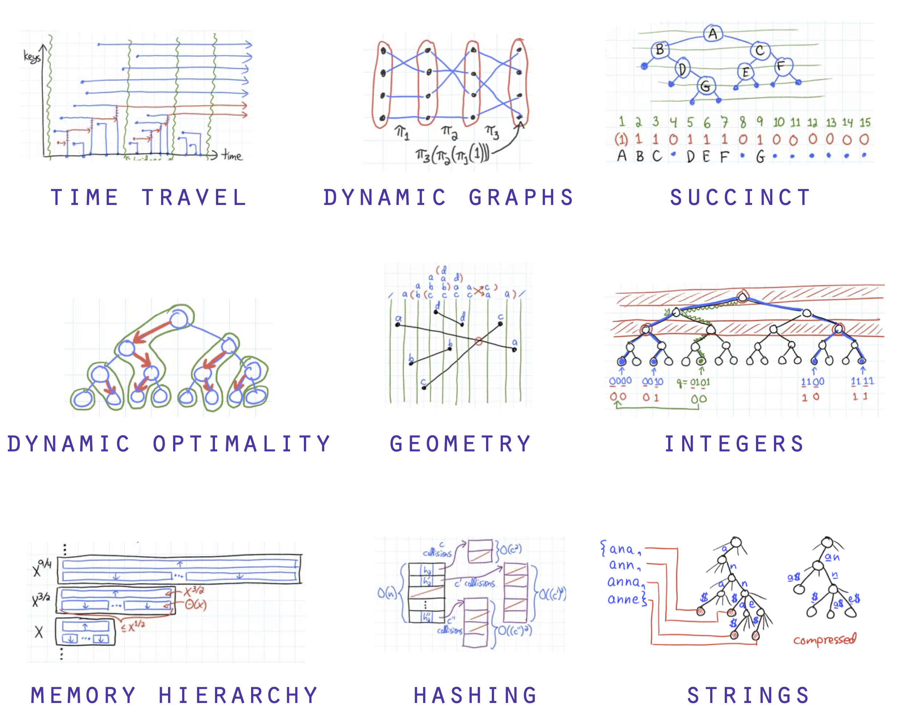

<style>

    footer {
        color: #567890;
    }
    /* Add "Page" prefix and total page number */
    section::after {
        font-size: small;
        content: 'Pág. ' attr(data-marpit-pagination) ' / ' attr(data-marpit-pagination-total);
    }


    section {
        padding-left: 1.1em;
        padding-right: 1.1em;
    }

    /** Seções */
    section:has(> header + h1 + footer) {
        background-color: #567890;        
    }

    section:has(> header + h1 + footer) * {
        color: white;
    }

    section:has(> header + h1 + footer) h1 {
        text-align: center;
        font-variant: small-caps;
        font-size: 6em;
    }
    /***/

    blockquote {
        border: 0;
        color: initial;        
        background-color: #7986CB22;
        padding: .3em .5em;
        border-radius: .25em;
        text-align: justify;
    }

    blockquote:has(> h1) {
        padding: 0em;
        padding-bottom: .5em;
        border-bottom-left-radius: .5em;
        border-bottom-right-radius: .5em;
    }
    blockquote:has(> h1) :not(h1, strong, .MathJax) {
        margin-right: .5em;
    }
    blockquote:has(> h1) p {
        margin-left: .5em;
    }


    blockquote h1 {
        color: white;
        font-variant: small-caps;
        font-size: 1em;
        background-color: #7986CB;
        margin: 0;
        padding: .3em .5em;
        border-top-left-radius: .5em;
        border-top-right-radius: .5em;
        margin-bottom: .5em;
    }

    blockquote:has(> blockquote:has(> blockquote)) {
        background-color: #7FFFD4;        
    }
    blockquote:has(> blockquote) {
        background-color: #F4A46044;        
    }


    blockquote:has(> blockquote) blockquote {
        background-color: transparent;
        padding: 0;
    }
    
    h1 code {
        font-size: .75em;
    }

    h4 {
        font-size: .75em;
        font-weight: 400;
        line-height: 1.7;
        font-variant: small-caps;
    }

    h2, h3, h4 {
        margin: 0;
    }
</style>

# Estrutura  de Dados
## Tipo abstrato de dados
#### Curso de Análise e Desenvolvimento de Sistemas
#### Última revisão: **2024.2**




---
<style scoped>
    h1 {font-size: 5em;}
</style>
# Revisão de Orientação a Objetos
---

# Orientação a Objetos em Python (modo rápido)
<style scoped>
    blockquote, pre {
        width: 45%;
    } 
    li {
        text-align: left;
    }

    pre {
        position: absolute;
        left: 48%;
        top: 25%;
    }
</style>

> # Definições de classes
> - Os atributos armazenam dados para uso de cada objeto;
> - Os construtores permitem que cada objeto seja configurado adequadamente quando ele é criado;
> - Não há visibilidade em Python;
> - Os métodos implementam o comportamento dos objetos.

```python
class Nome_Da_Classe:

    # atribudo de classe
    _instances = []

    # construtor
    def __init__(self, value):
        # atributos de instancias
        self._value = value
        self._instances.append(value)

    # método de instância
    def double(self):
        self._value *= 2

    # método de classe
    @classmethod
    def increment_by(cls, value, increment):
        return value + increment

    # método statico
    @staticmethod
    def increment_by(value, increment):
        return value + increment
 ```

---
# Tipo abstrato de dados
---
# Tipo abstrato de dados

> # Tipo abstrato de dados (TAD)
> **Um TAD define**:
> - um novo tipo de dado (no nosso caso uma classe);
> - o conjunto de operações para manipular dados desse tipo (os métodos).
>
> **Um TAD facilita**:
> - a manutenção e a reutilização de código;
> - a abstração – forma de implementação não precisa ser conhecida.
>
> 
> Por fim, para utilizar um TAD é necessário conhecer a sua **funcionalidade**, mas não a sua **implementação**.


---
# Tipo abstrato de dados
 
> # Tipo abstrato de dados (TAD) – continuação
> **Um TAD faz uso de encapsulamento porque:**
> - agrupa a estrutura de dados juntamente com as operações adequadas/disponíveis;
> - e encapsula a estrutura de dados, pois usuários só podem usar operações disponibilizadas.
> 
> **Um TAD na sua implementação tem como premissa que:**
> - o há dois atores, a saber, o Usuário do TAD e o Programador do TAD. O usuário só "enxerga" a interface, não a implementação;
> - a escolha de uma representação específica é fortemente influenciada pelas operações a serem executadas.


---

# Exemplo
<style scoped>
    pre {width: 40%; margin-top: -1em;}
    pre + pre {
        position: absolute;
        right: 11%;
    }
</style>
```python
from typing import Self

class ContaBancaria:

    def deposito(
        self,
        valor: float
    ) -> bool
    
    def saque(
        self, 
        valor: float
    ) -> bool:

    def transferencia(
        self,
        conta_destino: Self,
        valor: float
    ) -> bool:
        
        self.saque(valor):
        conta_destino.deposito(valor)
```

```python
from conta_bancaria import ContaBancaria

class ContaPoupanca(ContaBancaria):

```

---

# Referências

- Paul Rail. **All you need to know about “Big O Notation” to crack your next coding interview.** Disponível em: https://www.freecodecamp.org/news/all-you-need-to-know-about-big-o-notation-to-crack-your-next-coding-interview-9d575e7eec4/.
- Prof. José Maria Monteiro. **INF 1010 Estruturas de Dados Avançadas: Complexidade de Algoritmos**. Disponível em: https://www.inf.puc-rio.br/~noemi/eda-19.1/complexidade.pdf.
- Prof. Reinaldo Fortes. **BCC202 - Estrutura de Dados I Aula 04: Análise de Algoritmos (Parte 1).** Disponível em: https://www.decom.ufop.br/reifortes.
- Prof. Reinaldo Fortes. **BCC202 - Estrutura de Dados I Aula 05: Análise de Algoritmos (Parte 2).** Disponível em: https://www.decom.ufop.br/reifortes.
- Programiz. **Asymptotic Analysis: Big-O Notation and More.** Disponível em: https://www.programiz.com/dsa/asymptotic-notations.
