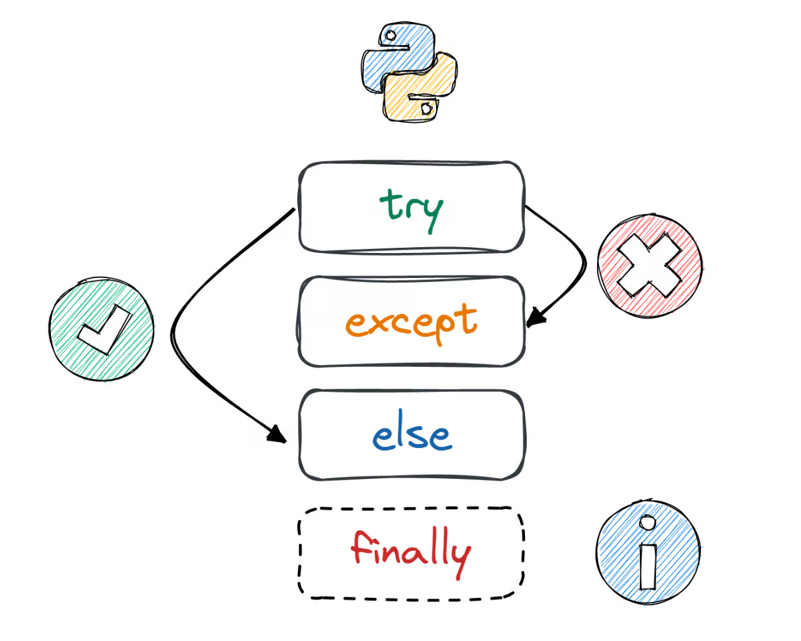

<style>

    footer {
        color: #567890;
    }
    /* Add "Page" prefix and total page number */
    section::after {
        font-size: small;
        content: 'Pág. ' attr(data-marpit-pagination) ' / ' attr(data-marpit-pagination-total);
    }


    section {
        padding-left: 1.1em;
        padding-right: 1.1em;
    }

    /** Seções */
    section:has(> header + h1 + footer) {
        background-color: #567890;        
    }

    section:has(> header + h1 + footer) * {
        color: white;
    }

    section:has(> header + h1 + footer) h1 {
        text-align: center;
        font-variant: small-caps;
        font-size: 6em;
    }
    /***/

    blockquote {
        border: 0;
        color: initial;        
        background-color: #7986CB22;
        padding: .3em .5em;
        border-radius: .25em;
        text-align: justify;
    }

    blockquote:has(> h1) {
        padding: 0em;
        padding-bottom: .5em;
        border-bottom-left-radius: .5em;
        border-bottom-right-radius: .5em;
    }
    blockquote:has(> h1) :not(h1, strong, .MathJax) {
        margin-right: .5em;
    }
    blockquote:has(> h1) p {
        margin-left: .5em;
    }


    blockquote h1 {
        color: white;
        font-variant: small-caps;
        font-size: 1em;
        background-color: #7986CB;
        margin: 0;
        padding: .3em .5em;
        border-top-left-radius: .5em;
        border-top-right-radius: .5em;
        margin-bottom: .5em;
    }

    blockquote:has(> blockquote:has(> blockquote)) {
        background-color: #7FFFD4;        
    }
    blockquote:has(> blockquote) {
        background-color: #F4A46044;        
    }


    blockquote:has(> blockquote) blockquote {
        background-color: transparent;
        padding: 0;
    }
    
    h1 code {
        font-size: .75em;
    }

    h4 {
        font-size: .75em;
        font-weight: 400;
        line-height: 1.7;
        font-variant: small-caps;
    }

    h2, h3, h4 {
        margin: 0;
    }
</style>

# Estrutura  de Dados
## Tipo abstrato de dados
#### Curso de Análise e Desenvolvimento de Sistemas
#### Última revisão: **2024.2**


---
<style scoped>
    h1 {font-size: 5em;}
</style>
# Revisão de Orientação a Objetos
---

# Orientação a Objetos em Python (modo rápido)
<style scoped>
    blockquote {
        width: 40%;
    } 
    li {
        text-align: left;
    }
    pre {
        position: absolute;
        left: 42%;
        top: 26%;
        width: 52%;
    }
    li {margin-left:-.5em;}
</style>

> # Definições de classes
> - Os atributos armazenam dados para uso de cada objeto;
> - Os construtores permitem que cada objeto seja configurado adequadamente quando ele é criado. **Atente para os atributos**;
> - Não há visibilidade em Python;
> - Os métodos implementam o comportamento dos objetos.

```python
class Nome_Da_Classe:
    # atribudo de classe
    _instances = []

    # construtor
    def __init__(self, value):
        # atributos de instancias
        self._value = value
        self._instances.append(self)

    # método de instância
    def double(self):
        self._value *= 2

    @classmethod
    def total(cls):
        return sum(v._value for v in cls._instances)
 ```

--- 
<style scoped>    
    pre {
        width: 40%;
        margin: 0 auto;
    }
    ol, ul {padding-left: 1em;}
</style>
# Boas práticas em Python (1)

> **Aqui algumas recomendações para garantir código limpo, reutilizável e fácil de entender.**

1. **Nomeação Clara e Intuitiva.**
- Use nomes descritivos e o padrão CamelCase para os nomes de classes.
```python
class Pessoa:
    pass


class Funcionario(Pessoa):
    pass


class Professor(Funcionario):
    pass
```

---
<style scoped>    
    pre {
        width: 80%;
        margin: 0 auto;
    }
    h1 {margin-top: -.5em; margin-bottom: -.125em}
    ol, ul {padding-left: 1em;}
</style>
# Boas práticas em Python (2)

2. **Definir um Construtor Apropriado**. 
- Utilize o método ```__init__``` para inicializar atributos;
- Declare atributos necessários explicitamente no construtor. Se possível, forneça valores padrão.
 
```python
class Carro:
    def __init__(self, marca, modelo, ano=2023):
        self.marca = marca
        self.modelo = modelo
        self.ano = ano


class Mobi(Carro):
    def __init__(self, ano=2023):
        super().__init__('Fiat', 'Mobi', ano)
```
---
<style scoped>    
    pre {
        width: 80%;
        margin: 0 auto;
    }
    h1 {margin-top: -.5em; margin-bottom: -.125em}
    ol, ul {padding-left: 1em;}
</style>
# Boas práticas em Python (2)

3. **Encapsulamento e Acesso a Atributos**. 
- Use prefixos de sublinhado ```_``` para atributos protegidos e ```__``` para atributos privados;
- Quando necessário, utilize o decorador ```@property``` e métodos ```getter``` e ```setter```.

```python
class ContaBancaria:
    def __init__(self, saldo_inicial=0):
        self.__saldo = saldo_inicial
    
    @property
    def saldo(self):
        return self.__saldo
    
    @saldo.setter
    def saldo(self, valor):
        if valor >= 0:
            self.__saldo = valor        
```

---
<style scoped>    
    pre {
        width: 35%;
        position: absolute;
        left: 59%;
        top: 25%;
    }
    h1 {margin-top: -.5em; margin-bottom: -.125em}
    ol, ul {
        padding-left: 1em; 
        width: 55%;
        
    }
    ol {
        padding-top: 1em;       
    }
</style>
# Boas práticas em Python (3)

4. **Organização e Modularidade**
- Cada classe deve ter uma responsabilidade clara; 
- Opte pelo *Single Responsibility Principle*;
- **Mantenha  classes pequenas** e com propósito único.

5. **Herdar com Propósito**
- Busque utiliza herança somente quando houver uma relação do tipo "é-um";
- Prefira composição à herança, quando apropriado.

```python
class Motor:

    def ligar(self):
        print("Motor ligado")


class Carro:

    def __init__(self):
        self.motor = Motor()


    def ligar(self):
        self.motor.ligar()
```

---
<style scoped>    
    pre:nth-of-type(1) {
        width: 40%;
        position: absolute;
        top: 15%;
        left: 54%;
    }
    h1 {margin-top: -.5em; margin-bottom: -.125em}
    ol, ul {padding-left: 1em; width: 50%;}

    pre + pre {
        width: 47%;
    }

</style>
# Boas práticas em Python (4)

6. Métodos Estáticos e de Classe
- Use ```@staticmethod``` para métodos que não dependem da instância;
- Use ```@classmethod``` para métodos que operam na classe como um todo.

```python
class Calculadora:
    # Precisão para arredondar
    precisao = 2

    @staticmethod
    def somar(a, b):
        """
        Método que realiza uma soma simples,
        independente da classe.
        """
        return a + b

    @classmethod
    def ajustar_precisao(cls, nova_precisao):
        """
        Método que altera a precisão global.
        """
        cls.precisao = nova_precisao

    def arredondar(self, valor):
        """
        Método de instância que utiliza a 
        precisão global.
        """
        return round(valor, self.precisao)
```

```python
resultado = Calculadora.somar(10, 20)
print(f"Resultado da soma: {resultado}")  

calc = Calculadora()
valor_arredondado = calc.arredondar(123.456789)
print(f"Valor arredondado: {valor_arredondado}") 

Calculadora.ajustar_precisao(3)

valor_arredondado = calc.arredondar(123.456789)
print(f"Valor arredondado: {valor_arredondado}") 
```
--- 
<style scoped>    
    pre {
        width: 80%;
        margin: 0 auto;
    }
    h1 {margin-top: -.5em; margin-bottom: -.125em}
    ol, ul {padding-left: 1em;}
</style>
# Boas práticas em Python (4)

7. **Documente e faça anotações de tipos**
- Adicione docstrings explicativas nas classes e métodos;
- Use anotações de tipo para indicar os tipos esperados de atributos e parâmetros.

```python
class Usuario:
    """
    Representa um usuário com nome e idade.
    """
    def __init__(self, nome: str, idade: int):
        self.nome = nome
        self.idade = idade
```

8. **Boa Utilização de Herança e Interfaces**
- Aplique polimorfismo e respeite os princípios de substituição de Liskov para evitar surpresas ao usar herança.
 

--- 
<style scoped>    
    pre {
        width: 45%;
        position: absolute;
        top: 20%;
        left: 50%;
        margin-top: -.5em
    }
    h1 {margin-top: -.5em}
    p, ul {
        width: 48%;
    }
    ul {padding-left: 1em; font-size: .8em;}
</style>
# Princípio da Substituição de Liskov

Se uma classe provê funcionalidade (```Fornecedor```), ela deve definir uma fórmula preestabelecida (obrigação) de como a rotina utilizadora (```Cliente```) deve obter a funcionalidade.


- É obrigação do ```Cliente``` implementar o método da maneira estabelecida;
- É obrigação do ```Fornecedor``` prover as formas de se implementar;
- É benefício do ```Fornecedor``` executar a funcionalidade sem imprevistos;
- É benefício do ```Cliente``` obter o resultado desejado.


```python
class Funcionario:
    def obter_salario(self) -> float:
        raise NotImplementedError()

class Operario(Funcionario):
    def obter_salario(self) -> float:
        return 1_000

class Gerente(Funcionario):
    def obter_salario(self) -> float:
        return 10_000

class Vendedor(Funcionario):
    def obter_salario(self) -> float:
        return 1_000 + self.comissoes()

class Financeiro:
    @classmethod
    def pagar(cls, func: Funcionario) -> None:
        salario = func.get_salario()
        # restante da rotina de pagamento
```
--- 
<style scoped>    
    pre {
        width: 90%;
        margin: 0 auto;
    }
    h1 {margin-top: -.5em; margin-bottom: -.125em}
    ol, ul {padding-left: 1em;}
</style>
# Boas práticas em Python (5)

9. Sobrescrever Métodos Mágicos
-  Implemente métodos mágicos como ```__str__```, ```__repr__```, ```__eq__```, e outros para melhorar a legibilidade, funcionalidades e expressividade da linguagem.

```python
class Produto:
    def __init__(self, codigo: int, nome: str, preco: float) -> None:
        self.codigo = codigo
        self.nome = nome
        self.preco = preco
    
    def __str__(self) -> str:
        return f"Produto({self.nome}, R${self.preco:.2f})"

    def __eq__(self, outro: Produto) -> bool:
        return self.id == outro.id

a, b, c = Produto(1, 'sabao', 10), Produto(2, 'sabao', 10), Produto(1, 'pastel', 10)
print(a == b, a == c, b == c, a, b, c)
```

---
# Tipo abstrato de dados
---
# Introdução (1)
<style scoped>
    h1 {margin-top: -.5em;}
</style>

> # Tipo abstrato de dados (TAD)
> **Um TAD define**:
> - um novo tipo de dado (no nosso caso uma classe);
> - o conjunto de operações para manipular dados desse tipo (os métodos).
>
> **Um TAD facilita**:
> - a manutenção e a reutilização de código;
> - a abstração – forma de implementação não precisa ser conhecida.
>
> 
> Por fim, para utilizar um TAD é necessário conhecer a sua **funcionalidade**, mas não a sua **implementação**.


---
# Introdução (2) 

> # Tipo abstrato de dados (TAD) – continuação
> **Um TAD faz uso de encapsulamento porque:**
> - agrupa a estrutura de dados juntamente com as operações adequadas/disponíveis;
> - e encapsula a estrutura de dados, pois usuários só podem usar operações disponibilizadas.
> 
> **Um TAD na sua implementação tem como premissa que:**
> - o há dois atores, a saber, o Usuário do TAD e o Programador do TAD. O usuário só "enxerga" a interface, não a implementação;
> - a escolha de uma representação específica é fortemente influenciada pelas operações a serem executadas.


---

# Exemplo TAD Conversor de Unidades (2)
<style scoped>
    pre {
        margin-top: -.75em;
        width: 55%;
    }

    pre + pre {
        width: 36%;
        position: absolute;
        left: 59%;
        top: 23%;
    }
</style>

```python
class ConversorDeUnidades:
    def __init__(self):
        
        self._fatores = {
            ("m", "km"): 0.001,
            ("km", "m"): 1000,
            ("c", "f"): lambda c: c * 9/5 + 32,
            ("f", "c"): lambda f: (f - 32) * 5/9,
        }

    def converter(self, valor, de, para):
        chave = (de, para)
        if chave not in self._fatores:
            raise ValueError("Conversão não suportada.")

        fator = self._fatores[chave]
        
        # Se o fator for uma função, execute-a
        if callable(fator):
            return fator(valor)
        return valor * fator
```

```python  
# Continuação
cdu = ConversorDeUnidades()

# Conversão de metros para quilômetros
# Saída: 1.5
print(cdu.converter(1500, "m", "km"))  

# Conversão de Celsius para Fahrenheit
# Saída: 77.0
print(cdu.converter(25, "c", "f"))  

# Conversão de Fahrenheit para Celsius
# Saída: 25.0
print(cdu.converter(77, "f", "v"))  

# Tentativa de conversão não suportada
try:
    print(cdu.converter(100, "m", "mi"))
    
except ValueError as e:
    print(e)  
    # Saída: Conversão não suportada.
```

---

# Exemplo TAD Conversor de Unidades
<style scoped>
    blockquote { margin-top: -.75em}
    
</style>
> # Características importantes
> - **Encapsulamento**;
A lógica de conversão é escondida dentro do dicionário ```_fatores```e o método converter gerencia o processo.
> - **Abstração**;
O usuário não precisa saber se a conversão é realizada por um fator multiplicativo ou uma função; ele apenas obtém o resultado correto ao interagir apenas com o método ```converter```, fornecendo os valores e unidades desejadas.
> - **Flexibilidade**.
A implementação permite adicionar facilmente novos pares de conversão em ```_fatores```.

---

# Exceções

O tratamento adequado de condições de exceção é essencial para um desenvolvimento de software sólido. 

Mas **o que é uma exceção?**

> # Exceção
> Em termos de desenvolvimento de software, é uma situação anômala na qual o estado do programa está em risco de se tornar ou se tornou instável ou corrompido.

<style scoped>

    section > p:nth-of-type(1) {
        width: 38%;
        margin-top: -.75em;
    }

    blockquote, pre {
        width: 48%;
    }

    pre {
        width: 56%;
        position: absolute;
        top: 21%;
        left: 37%;
    }

    pre + pre {
        position: absolute;
        top: 50%;
        left: 50%;
        width: 43%;
    }
</style>

```python
def div(x: int, y: int) -> float:
    if y == 0:
        raise ZeroDivisionError('inderteminado')

    return x / y
```

```sh
>>> div(1,2)
0.5
>>> div(1,0)
Traceback (most recent call last):
  File "<stdin>", line 1, in <module>
  File "<stdin>", line 3, in div
ZeroDivisionError: indeterminado
```

---
<style scoped>
    h1, p {margin-top: -.5em; text-align: justify}

</style>
# Lidando com Exceptions utilizando o bloco ```try``` ```except```


Lidar com erros é uma parte essencial do desenvolvimento de software. Em Python, uma das formas mais eficazes de tratar esses erros é utilizando o bloco ```try``` ```except```. Esse bloco permite que você ***tente*** executar um bloco de código e, caso ocorra um erro, ***capture*** essa exceção e execute um código alternativo. 

```python
try:
    x = int(input("Digite um número: "))
    y = int(input("Digite outro número: "))
    resultado = x / y
    print(f"O resultado é: {resultado}")

except ZeroDivisionError:
    print("Erro: Não é possível dividir por zero!")

except ValueError:
    print("Erro: Entrada inválida! Por favor, digite um número.")
```
---
<style scoped>
    h1{margin-top: -.75em}
    p:nth-of-type(1) {margin-top: -.75em}
    pre {width: 67%; margin-top: -.33em;}
    
    img[alt=alt] {
        position: absolute;
        left: 70%;
        top: 40%;
        width: 28%;
    }
</style>

# Utilizando os blocos ```try```, ```except```, ```else``` e ```finally```

O bloco ```else``` é executado apenas se o bloco ```try``` não gerar nenhuma exceção, sendo **útil para separar o código que deve ser executado apenas quando não há erros**. Já o bloco ```finally``` é **executado independentemente de qualquer exceção que ocorra**, sendo útil para liberar recursos ou executar ações de limpeza/finalização.



```python
try:
    ...
    resultado = x / y

except ZeroDivisionError:
    print("Erro: Não é possível dividir por zero!")

else:
    print(f"O resultado é: {resultado}")

finally:
    print('Terminou')
```


---

# Gerar uma ```Exception``` e parando a execução do código

Para gerar uma exceção e parar a execução do código, utilizamos a palavra-chave ```raise```. Isso nos permite lançar uma exceção em qualquer ponto do nosso código, i**nterrompendo sua execução imediatamente**.

```python
def dividir(a: int, b: int) -> float:
    if b == 0:
        raise ValueError("Divisor não pode ser zero!")
    return a / b

try:
    resultado = dividir(10, 0)

except ValueError as e:
    print(f"Erro: {e}")
```

> # Quando lançar exceções?
> É útil para garantir que erros críticos sejam tratados imediatamente. Isso é especialmente importante em situações em que continuar a execução do código poderia levar a resultados incorretos ou danificar dados.

<style scoped>
    blockquote {
        width: 58%;
        position: absolute;
        top: 54%;
        left: 40%;
    }

    section > h1, p {margin-top: -1em; text-align: justify}
    blockquote p {
        margin-top: 0em;
    }

</style>

---

# Exceções embutidas

Abaixo, segue uma listagem de algumas Exceções embutidas:

- Arquivo não encontrado: ```FileNotFoundError```;
- Transformando string em inteiro ```ValueError```;
- Buscando um índice fora da lista ```IndexError```;
- Buscando chave inexistente em um dicionário: ```KeyError```;
- Acessars variável inexistente ```NameError```; 
- Somando uma string e um número: ```TypeError```;
- Dividindo valor por zero: ```ZeroDivisionError```;
- Importando biblioteca não instalada: ```ModuleNotFoundError```.


---
<style scoped>
    p:nth-of-type(1) {text-align: justify;}
    h1 + p {
        margin-top: -1em;
    }

    blockquote li {
        text-align: left;
    }
</style>
# Boas práticas (1)
Além de usar exceções embutidas, podemos criar nossas próprias exceções personalizadas. Isso é útil quando queremos fornecer mensagens de erro mais específicas ou quando estamos desenvolvendo uma biblioteca e queremos que os usuários lidem com erros de maneira específica.

> # Boas Práticas
> - **Especificidade**. Crie exceções personalizadas para situações específicas que não são cobertas pelas exceções embutidas;
> - **Clareza**. Forneça mensagens de erro claras e informativas;
> - **Documentação**. Documente suas exceções personalizadas para que outros  saibam como usá-las e tratá-las.

---

# Boas práticas (2)
<style scoped>
    pre {
        width: 50%;
        position: absolute;
        right: 5%;
        top: 28%;
    }

    p {
        width: 38%;
    }
    
</style>
Criar exceções personalizadas permite que você forneça mensagens de erro mais claras e específicas, facilitando a depuração e o tratamento de erros. 

**Isso é especialmente útil em projetos maiores ou em bibliotecas que serão usadas por outras pessoas.**


```python
from datetime import datetime

class PixForaHorario(Exception):
    
    def __init__(self):
        super().__init__("Horário noturno.")


class LimiteDiarioAtingido(Exception):
    
    def __init__(self):
        super().__init__("Limite diário atingido.")

h = datetime.now().hour
if h > 22 or h < 6:
    raise PixForaHorario()
```


---

# Referências

- Adriano Soares. **Try e Except em Python – Entenda como lidar com erros.** Disponível em: https://hub.asimov.academy/blog/try-except-python/
- Python Software Foundation. **Erros e exceções.** Disponível em: https://docs.python.org/pt-br/3.13/tutorial/errors.html
- Python Software Foundation. **Built-in Exceptions.** Disponível em: https://docs.python.org/3/library/exceptions.html
- Ricardo Dias. **O Princípio da Substituição de Liskov.** Disponível em: https://medium.com/contexto-delimitado/o-princ%C3%ADpio-da-substitui%C3%A7%C3%A3o-de-liskov-df5648906fbe