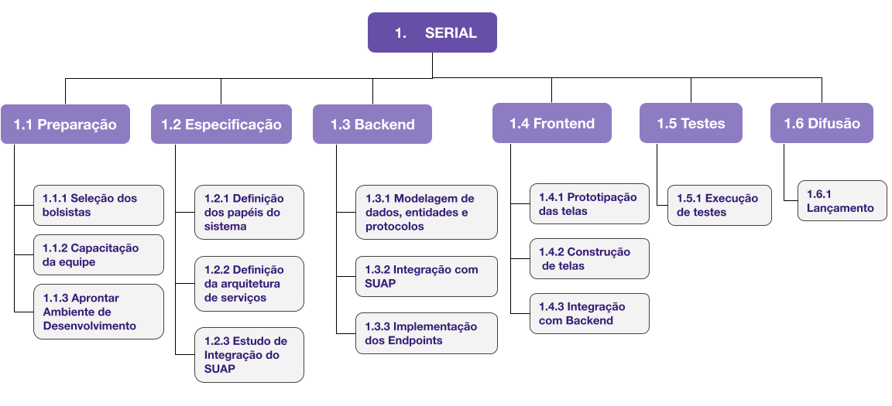

# DADOS DO SUBMITANTE

Saulo Anderson Freitas de Oliveira

# TÍTULO

SERIAL - Sistema Eletrônico de Requisições e Informações do Aluno.

# DEMANDA A SER SOLUCIONADA OU AMADURECIDA

Aplicativo do aluno

# TRL FINAL DA SOLUÇÃO

A solução SERIAL, voltada para a demanda do Aplicativo de aluno, atingiria o nível de prontidão tecnológica 5, indicando que o design está completo, e uma demonstração da solução estaria disponível em um ambiente de teste. Neste estágio, as principais funcionalidades foram projetadas e implementadas e a solução está pronta para ser avaliada em um ambiente controlado. Como funcionalidades-chaves tem-se:

1. Solicitar/acompanhar/cancelar auxílios;
2. Marcar presença;
3. Consultar notas/presença por disciplina;
4. Solicitar/acompanhar/cancelar matrícula em disciplina;
5. Solicitar trancamento de curso.

Além disso, a arquitetura de microsserviços foi implementada e está sendo utilizada para modularidade e provável escalabilidade, bem como a integração com o SUAP foi concluída, incluindo o controle de acesso e a utilização de tabelas internas e interfaces específicas no SUAP. Ademais, consolidam-se as seguintes tecnologias, a saber, Frontend desenvolvido em React com Bootstrap, Backend implementado em Python com o framework Django e Banco de dados PostgreSQL. Em resumo:

1. **Atividades realizadas**. As funcionalidades-chave foram implementadas de acordo com os requisitos estabelecidos, bem como, a arquitetura de microsserviços foi implementada e a integração com SUAP concluída. Assim, uma versão demonstrativa da solução foi implantada em um ambiente de teste, permitindo avaliações mais detalhadas.
2. **Resultados e Validação**. A solução demonstra as funcionalidades-chave de maneira satisfatória em um ambiente de teste controlado e, com isso, é possível coletar feedbacks inicial de usuários de teste para validar a usabilidade e a eficácia da solução.
3. **Desafios superados**. Possíveis desafios, como a integração com o SUAP e a implementação da arquitetura de microsserviços, foram superados com sucesso.
4. **Próximos passos previstos**. Refinamento com base no *feedback* dos usuários de teste e a preparação para a próxima fase, que envolverá a implantação em um ambiente controlado.

# OBJETIVOS

Desenvolver uma plataforma eficiente e intuitiva para atender às necessidades dos alunos no que diz respeito a solicitações e acompanhamento de serviços acadêmicos. De forma mais objetiva, temos os seguintes objetivos.

Das **funcionalidades para os alunos**:

1. Permitir que os alunos solicitem, acompanhem e cancelem auxílios financeiros;
2. Facilitar o registro de presença em atividades acadêmicas;
3. Oferecer consulta de notas e presença por disciplina;
4. Possibilitar a solicitação, acompanhamento e cancelamento de matrículas em disciplinas;
5. Permitir a solicitação de trancamento de curso.

Em relação à **Arquitetura da Solução**, objetivamos:

1. Adotar uma arquitetura de microsserviços para garantir escalabilidade, manutenibilidade e flexibilidade na expansão da plataforma;
2. Utilizar o Frontend em React e Bootstrap para proporcionar uma interface amigável, interativa e responsiva aos usuários;
3. Implementar o Backend em Python, utilizando o framework Django e PostgreSQL, visando uma base sólida e eficiente para o processamento das requisições;
4. Integração com o SUAP para controlar o acesso dos usuários e utilizar informações presentes nas tabelas internas e interfaces do SUAP, garantir a segurança e confidencialidade das informações durante a integração.

Em relação à **Metodologia de Desenvolvimento**:

1. Adotar metodologias ágeis, como SCRUM, para garantir entregas incrementais e alinhamento contínuo com as necessidades dos usuários;
2. Realizar revisões periódicas de código e testes para assegurar a qualidade e robustez da solução;
3. Implementar testes automatizados para garantir a estabilidade e o correto funcionamento de todas as funcionalidades;
4. Priorizar a qualidade do código por meio de boas práticas de desenvolvimento e revisões regulares;
5. Elaborar documentação, incluindo manuais de usuário e documentação técnica, para facilitar a compreensão e manutenção da solução.

Acerca dos elementos de **Inovação**, objetivamos:

1. Utilizar análise preditiva para prever a demanda por disciplinas e otimizar o processo de matrícula;
2. Incorporar Processamento Natural de Linguagem PNL para permitir que os alunos interajam com o sistema de forma natural, fazendo perguntas sobre auxílios, notas, matrículas, etc, ou via *chatbots* alimentados por IA para fornecer respostas imediatas a consultas comuns dos alunos.

#  METODOLOGIA

A metodologia de desenvolvimento deste projeto segue o modelo em cascata que prevê a especificação, desenvolvimento, validação e evolução de cada uma das atividades de maneira distinta. Com exceção das Atividades 1 - Preparação e 2 - Especificação, as demais atividades, seguirão à risca o modelo em cascata. Para evitar repetição, na seção DICIONÁRIO DA EAP, há uma breve descrição da atividade e subatividades.

# RESULTADOS ESPERADOS

Ao se desenvolver um sistema abrangente de solicitações para alunos com os elementos mencionados (vide objetivos), espera-se alcançar diversos resultados positivos, contribuindo para uma gestão acadêmica mais eficiente e uma experiência aprimorada para os usuários. Aqui estão alguns resultados esperados:

1. **Melhoria na Experiência do Aluno.** Os alunos terão uma plataforma centralizada para realizar diversas solicitações, como auxílios, matrículas e trancamento de curso, proporcionando conveniência e agilidade. Além disso, a marcação de presença e a consulta de notas por disciplina estarão acessíveis, permitindo aos alunos um acompanhamento mais efetivo de seu desempenho acadêmico;
2. **Eficiência Operacional.** O sistema permitirá a automatização de processos, reduzindo a carga administrativa associada a tarefas manuais, como o acompanhamento de matrículas e o controle de auxílios e processamento de requerimentos. Além de que, a arquitetura em microsserviços facilitará a escalabilidade, manutenção e expansão do sistema, promovendo uma infraestrutura mais flexível e eficiente;
3. **Favorecimento da tomada de decisões informatizadas acerca de intervenções pedagógicas.** A consulta de notas e presença por disciplina proporcionará aos servidores uma visão mais clara do desempenho dos alunos, permitindo a tomada de decisões informada sobre intervenções pedagógicas;
4. **Transparência e Comunicação efetiva.** Os alunos poderão acompanhar em tempo real o status de suas solicitações, promovendo transparência e comunicação efetiva entre a instituição e os estudantes. Ademais, a facilidade de cancelamento de solicitações proporcionará uma resposta rápida às mudanças nas necessidades dos alunos.

# EAP

# DICIONÁRIO EAP

| ATIVIDADE                                      | DESCRIÇÃO                                                    | RESPONSÁVEL                      | CRITÉRIO DE ACEITAÇÃO                                        |
| ---------------------------------------------- | ------------------------------------------------------------ | -------------------------------- | ------------------------------------------------------------ |
| 1.1.1 Seleção dos bolsistas                    | Elaborar edital e selecionar alunos, além de promover divulgação em diversos canais da instituição. | Coordenador e Líderes técnico.   | Edital de processo seletivo simplificado com lista de aprovados. |
| 1.1.2 Capacitação da equipe                    | Capacitação dos bolsistas na área de desenvolvimento de sistemas nos padrões atuais. Esta etapa se apoia fortemente no ensino com desafios semanais propostos a fim de se avaliar o aproveitamento dos bolsistas. | Coordenador e Líderes técnico.   | Relatório de aproveitamento, somente para aqueles bolsistas que atinjam 75% dos critérios de avaliação. |
| 1.1.3 Aprontar ambiente de Desenvolvimento     | Organizar a rotina de trabalhos, espaço físico, horários das Daily, formato de entrega, repositório de códigos, dentre outros. | Coordenador e Líderes técnico.   | Elaborar relatório deambiente configurado.                   |
| 1.2.1 Definição dos papéis do sistema          | Nesta etapa, será feito levantamento e discutido um conjunto de requisitos oriundos da pesquisa bibliográfica. A metodologia de execução será discutida a fim de que seja realizada a formalização da metodologia a ser seguida nas aplicações de interesse, bem como a definição da codificação, testes, e demais etapas de desenvolvimento. | Todos                            | Artefatos da Engenharia de Software (Casos de uso, Diagramas estruturais e comportamentais). |
| 1.2.2 Definição daarquitetura demicrosserviços | Nessa etapa, são estabelecidos os principais fundamentos e diretrizes que irão orientar a construção e a interação entre os microsserviços que comporão a aplicação. | Todos                            | Artefatos da Engenharia de Software.                         |
| 1.2.3 Estudo deintegração do SUAP              | Estudo detalhado das APIs ou interfaces disponíveis no SUAP e avaliação das operações oferecidas (Sincronização de dados, controle de acesso, formatos de dados utilizados pela solução e os requisitos do SUAP, dentre outros) pelo SUAP que são relevantes para o SERIAL. | Todos                            | Relatório acerca da integração com o SUAP.                   |
| 1.3.1 Modelagem dedados, entidades eprotocolos | Definição de um modelo de dados que representam as informações manipuladas pelo SERIAL (entidades, atributos, relacionamentos e restrições que governam a estrutura e o comportamento dos dados), bem como a definição dos protocolos de comunicação entre os diferentes componentes do sistema, sejam eles módulos internos, microsserviços, APIs externas ou outras entidades. Além disso, define os padrões para formatos de mensagens, métodos de troca e comunicação com os endpoints. | Coordenador e Líderes técnico    | Artefatos da Engenharia de Software (Casos de uso, Diagramas estruturais e comportamentais) e documentação detalhada dos endpoints, incluindo descrições, exemplos e formatos de dados. |
| 1.3.2 Integração comSUAP                       | Desenvolvimento de casos de teste específicos para validar a integração entre a solução acadêmica e o SUAP e realização de testes de ponta a ponta para garantir que a solução funcione corretamente em conjunto com o SUAP. | Todos, exceto Bolsistas Frontend | Caderno de testes de integração.                             |
| 1.3.3 Implementaçãodos Endpoints               | Implementação dos endpoints que serão responsáveis por receber as requisições dos clientes, processar as operações correspondentes e retornar as respostas apropriadas. Aqui, tem-se as rotas, tratamento de exceções e demais tratamentos de dados. | Todos, exceto Bolsistas Frontend | Documentação detalhada dos endpoints, incluindo descrições, exemplos e formatos de dados. |
| 1.4.1 Prototipaçãode telas                     | Estabelecimento dos fluxos de usuário através do sistema, delineando como os usuários irão navegar entre diferentes telas, identificação de pontos críticos de interação e transições entre as diferentes partes da aplicação. | Todos, exceto Bolsistas Backend  | Protótipos interativos de baixa fidelidade (Wireframes e esboços) e documentação detalhada das decisões de design, incluindo cores, tipografia, espaçamento e outros elementos visuais. |
| 1.4.2 Implementaçãode telas                    | Foco na transformação dos designs e protótipos em interfaces de usuário funcionais e interativas. Durante essa etapa, os desenvolvedores traduzem as especificações de design em código, incorporando lógica de interface e interatividade. | Todos, exceto Bolsistas Backend  | Interfaces de usuário funcionais e interativas, responsivas e compatíveis com diferentes navegadores e dispositivos. |
| 1.4.3 Integraçãocom Backend                    | Estabelecimento de comunicação eficiente entre a camada de frontend e o backend, garantindo a transferência correta de dados (tratamento). | Todos                            | Caderno de testes de integração entre Back e Front.          |
| 1.5.1 Execuçãode testes                        | Implementação de testes automatizados para garantir a estabilidade e o correto funcionamento de todas as funcionalidades, priorizando a qualidade do código por meio de boas práticas de desenvolvimento e revisões regulares. | Todos                            | Relatórios de teste documentando resultados e descobertas.   |
| 1.6.1Lançamento                                | Implementação do código-fonte da aplicação no ambiente controlado (atualização de arquivos, configurações e outros recursos necessários para a execução da aplicação). | Todos                            | Aplicação implantada e em execução em ambiente controlado com documentação atualizada. |

# CRONOGRAMA

| **ATIVIDADE**                                                | **MÊS 1** | **MÊS 2** | **MÊS 3** | **MÊS 4** | **MÊS 5** | **MÊS 6** | **MÊS 7** |
| ------------------------------------------------------------ | --------- | --------- | --------- | --------- | --------- | --------- | --------- |
| Capacitação nas tecnologias e ferramentas específicas do projeto | X         |           |           |           |           |           |           |
| Preparação do Ambiente de desenvolvimento e da Infraestrutura necessária | X         |           |           |           |           |           |           |
| Modelagem dos elementos do sistema (Entidades, Banco de dados, permissões) | X         | X         |           |           |           |           |           |
| Implementação do Backend                                     |           | X         | X         | X         | X         | X         |           |
| Prototipação do Frontend                                     |           | X         | X         |           |           |           |           |
| Implementação do Frontend                                    |           |           |           | X         | X         | X         |           |
| Execução de Testes                                           |           |           |           |           | X         | X         | X         |
| Publicação em Ambiente Controlado                            |           |           |           |           |           |           | X         |
